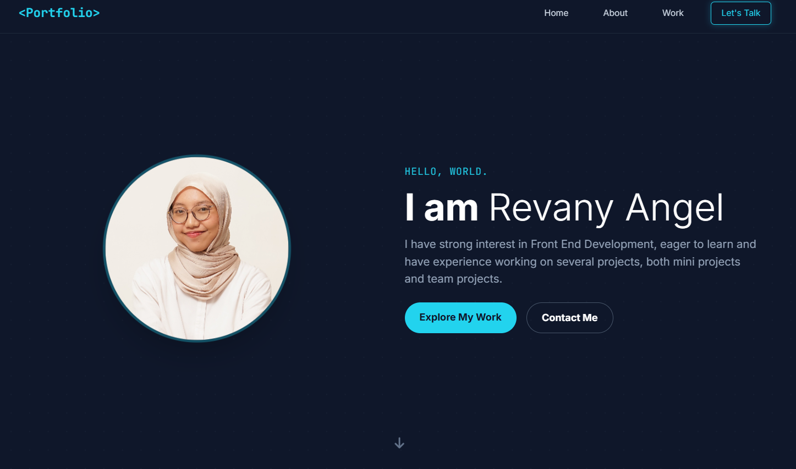
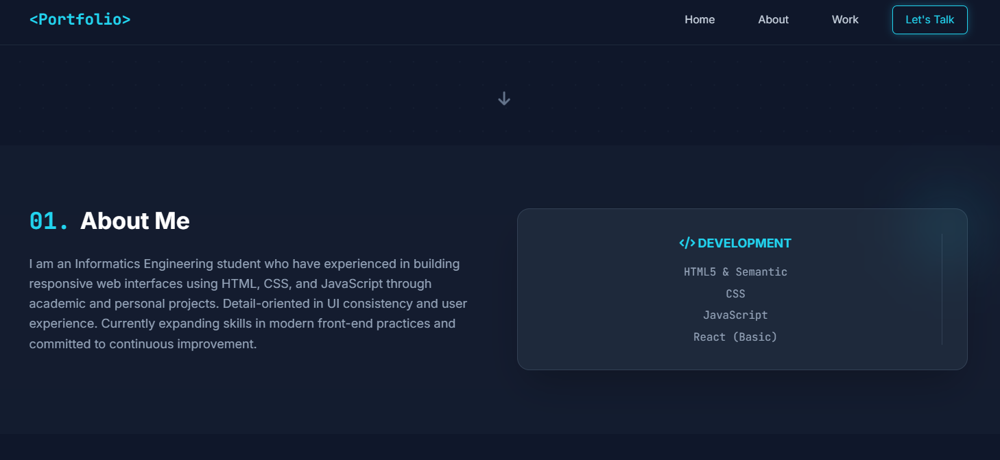
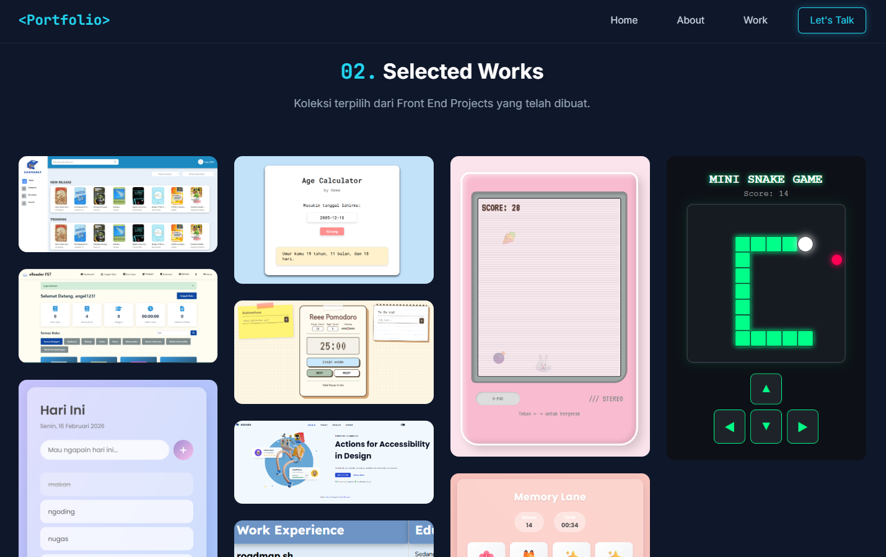

# 🚀 Personal Portfolio - Revany Angel

Selamat datang di repository portofolio saya! Project ini adalah website portofolio pribadi yang dirancang untuk menampilkan keahlian saya di bidang **Front-End Development** dan **UI/UX Design**. Website ini memiliki desain yang responsif, interaktif, dan futuristik dengan tema *dark mode*.

### 🔗 Live Demo
👉 **https://revanyangel.github.io/Revany-Angel-Porto-FE/**

---

<p align="center">
  
  
  
</p>

---

### 🛠️ Tech Stack
Website ini dibangun menggunakan teknologi modern untuk memastikan performa dan estetika yang optimal:
* **Core:** HTML5 (Semantic), CSS3
* **Styling:** [Tailwind CSS](https://tailwindcss.com/) (Custom configuration for neon theme)
* **Icons & Fonts:** Font Awesome 6, Google Fonts (Inter & JetBrains Mono)
* **Animations:** CSS Keyframes & Scroll Reveal JS

---

### ✨ Fitur Utama
* **Responsive Design:** Tampilan optimal di berbagai perangkat (Mobile, Tablet, Desktop).
* **Smooth Navigation:** Navigasi antar section menggunakan *smooth scrolling*.
* **Project Showcase:** Galeri proyek pilihan (Grid Layout) dengan efek *hover* yang interaktif.
* **Scroll Reveal Animation:** Elemen muncul secara bertahap saat di-scroll untuk pengalaman pengguna yang dinamis.
* **Mobile Menu:** Menu navigasi khusus perangkat mobile yang ringan dan responsif.

---

### 📂 Proyek yang Ditampilkan
Beberapa project unggulan yang ada di dalam portofolio ini antara lain:
* **EDU VAULT:** Perpustakaan online untuk akses buku dan jurnal.
* **EPUB Reader:** Web reader untuk membaca file format .epub secara online.
* **Pomodoro Timer:** Alat produktivitas dengan fitur To-Do List terintegrasi.
* **Mini Games:** Bunny Eating, Snake Game, dan Memory Game.
* **Utility Tools:** Age Calculator, Simple To-Do List, dan Cookie Consent.

---

### ⚙️ Instalasi Lokal
Jika Anda ingin menjalankan atau memodifikasi project ini secara lokal:

1. **Clone repository:**
   ```bash
   git clone [https://github.com/RevanyAngel/revany-portfolio.git](https://github.com/RevanyAngel/revany-portfolio.git)

2. **Buka folder project:**
   ```bash
   cd revany-portfolio

3. **Jalankan:**
  Buka file index.html langsung di browser atau gunakan extension Live Server di VS Code.